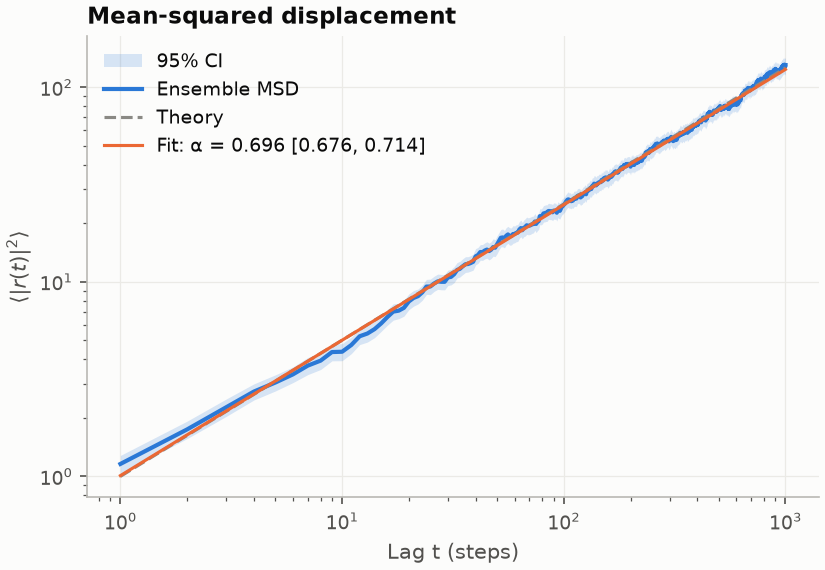
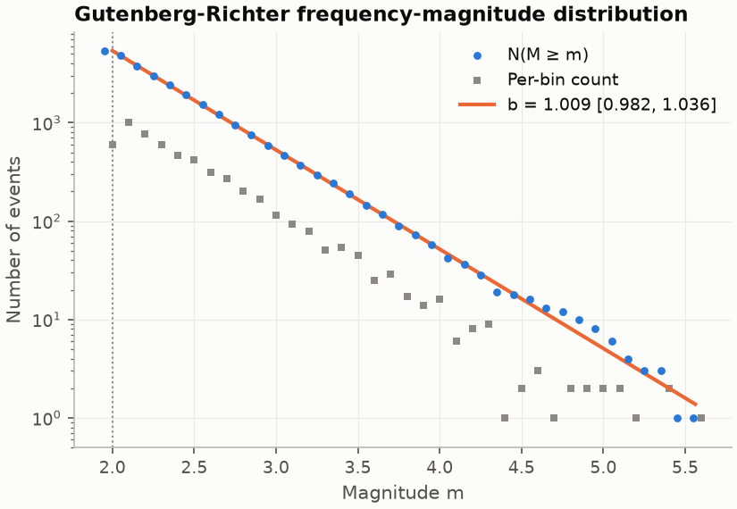
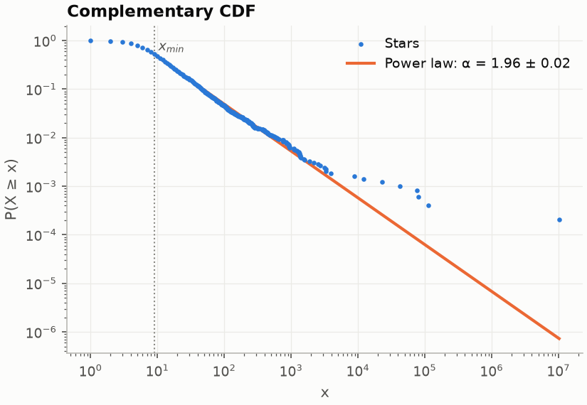
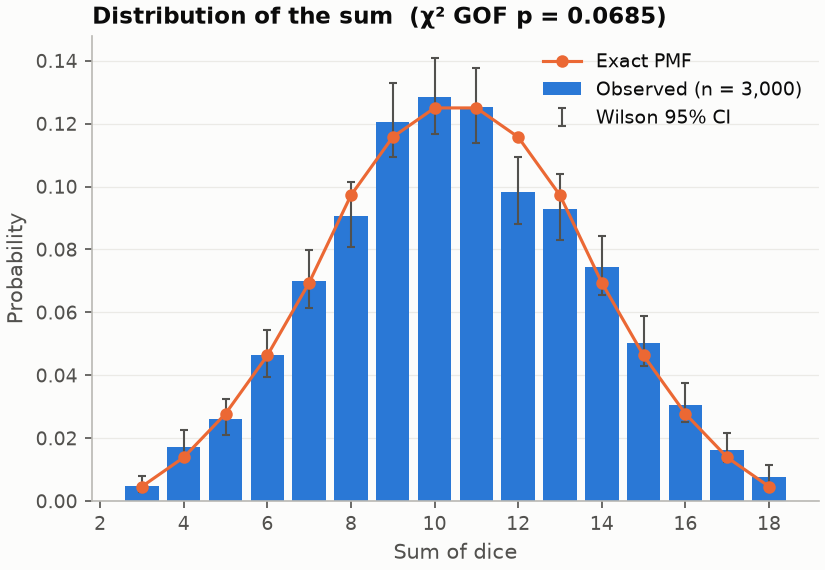

# PCC-VizForge

**Reproducible simulation, statistical inference and visualisation for canonical stochastic processes.**

[](https://github.com/SatvikPraveen/PCC-VizForge/actions/workflows/ci.yml)
[](pyproject.toml)
[](LICENSE)
[](https://github.com/astral-sh/ruff)
[](pyproject.toml)

PCC-VizForge generates synthetic data from five well-studied stochastic
models, estimates their parameters with the standard estimators from each
field, and records every run so that anyone can regenerate it bit-for-bit.
Because the true parameters of every generator are known, the package also
checks its own estimators: bias, RMSE and confidence-interval coverage are
measured by Monte Carlo ([`docs/validation.md`](docs/validation.md)).

| Domain | Generative model | Inference |
|---|---|---|
| **Random walks** | lattice, Gaussian, persistent, Lévy flight, fractional Brownian motion (exact Davies–Harte) | ensemble and time-averaged MSD, anomalous exponent with walk-bootstrap CI, ergodicity breaking, DFA, first passage |
| **Dice** | *n* fair or loaded dice | exact sum PMF by convolution, χ² GOF with Cochran pooling, runs test |
| **Earthquakes** | truncated Gutenberg–Richter magnitudes, sphere-uniform + hotspot epicentres, ETAS-style Omori–Utsu aftershock cascades | Aki–Utsu and truncated (Page) b-value MLEs, M<sub>c</sub>, Omori (c, p) MLE, clustering |
| **Weather** | WGEN: Markov-chain precipitation, Gamma amounts, AR(1) temperature anomalies, seasonal harmonic, warming trend, dew-point humidity | harmonic regression with Newey–West SEs, Mann–Kendall (Hamed–Rao / pre-whitening), Theil–Sen, Markov-chain MLE |
| **GitHub repositories** | Pareto latent popularity → Poisson stars; Beta fork propensity; NB commits | Clauset–Shalizi–Newman power-law fit, bootstrap GOF, Vuong tests vs lognormal/exponential |

The mathematics for every row is in [`docs/methods.md`](docs/methods.md).

<p align="center">
  
  
  
  
</p>

## Installation

```bash
git clone https://github.com/SatvikPraveen/PCC-VizForge.git
cd PCC-VizForge
python -m pip install -e ".[dev]"   # or: pip install -e .  (runtime only)
```

Requires Python ≥ 3.10. Static image export from Plotly needs the optional
`export` extra (`kaleido`).

## Quick start

### Command line

```bash
# Simulate, analyse and plot into a self-contained run directory
pcc-vizforge run quakes --seed 7 --set data_generation.b_value=0.8 --format png --format pdf

# Regenerate from the manifest and check the data hash
pcc-vizforge verify runs/quakes-<timestamp>-<id>

# Monte Carlo validation of the estimators
pcc-vizforge validate b_value --replicates 500

# Overview dashboards (Matplotlib PNG or interactive Plotly HTML)
pcc-vizforge dashboard weather --library plotly --export-type html
```

Every command accepts `--set key.path=value` overrides (values are parsed as
YAML) and `--config my.yaml`. Run `pcc-vizforge --help` for the full list.

### Python

```python
import numpy as np
from pcc_vizforge.generators import RandomWalkGenerator
from pcc_vizforge.generators.random_walk import frame_to_positions
from pcc_vizforge.analysis.diffusion import bootstrap_msd_exponent

gen = RandomWalkGenerator(model="fbm", hurst=0.3, n_walks=200, n_steps=1000, dimensions=2)
df = gen.generate(seed=42)                      # tidy DataFrame; df.attrs["provenance"] records the inputs
fit = bootstrap_msd_exponent(frame_to_positions(df), seed=0)
print(f"alpha = {fit.alpha:.3f}, 95% CI {fit.alpha_ci}, regime: {fit.regime}")  # true alpha = 2H = 0.6
```

```python
from pcc_vizforge.generators import EarthquakeGenerator
from pcc_vizforge.analysis.seismology import b_value_mle

quakes = EarthquakeGenerator(n_earthquakes=5000, b_value=1.1).generate(seed=1)
print(b_value_mle(quakes["magnitude"], mc=2.0))   # b, a, Shi–Bolt SE, CI
```

```python
from pcc_vizforge.experiments import run_experiment, verify_run

result = run_experiment("github", seed=3, overrides=["data_generation.popularity_exponent=2.3"])
assert verify_run(result.run_dir)["reproduced"]
```

## Reproducibility

- Every random draw comes from an explicit PCG64 `Generator` built from one
  recorded seed. Replicates use `SeedSequence.spawn`, and NumPy's global
  state is never touched.
- A run writes its resolved `config.yaml`, `data.csv`, `metrics.json`,
  `figures/` and a `manifest.json` containing the seed, config hash,
  dependency versions, git commit and a SHA-256 for every file.
- `pcc-vizforge verify` regenerates the data and compares hashes. CI runs and
  verifies every domain on every push.
- Configuration is validated into typed, frozen dataclasses; unknown keys
  are rejected.

Details and the exact scope of the guarantee are in
[`docs/reproducibility.md`](docs/reproducibility.md).

## Validation highlights

From [`docs/validation.md`](docs/validation.md), 500 replicates per setting:

| Estimator | Result |
|---|---|
| Aki b-value, n = 1000 | bias +0.003, RMSE 0.032, 95 % CI coverage 0.946 |
| fBm exponent (walk bootstrap), H = 0.75 | bias +0.003, coverage 0.942 |
| Discrete power-law α = 3.0, n = 1000 | bias +0.006, coverage 0.956 |
| χ² dice-sum test under H₀ | size 0.042–0.062 at α = 0.05 |
| Trend SE with AR(1) noise, φ = 0.7 | OLS coverage 0.556 → Newey–West 0.904 |

Validation found, and fixed, several estimators that under-covered:
- regression CIs for MSD exponents;
- continuous-formula SEs for discrete power laws;
- OLS trend SEs under autocorrelation.

The limitations that remain are documented, not hidden.

## Project layout

```
src/pcc_vizforge/
├── generators/      # seeded simulators (BaseGenerator + 5 domains)
├── analysis/        # inference, diffusion, probability, seismology, timeseries, heavy_tails
├── experiments/     # run pipeline, verification, Monte Carlo validation studies
├── plots/           # publication style, diagnostic figures, Matplotlib/Plotly dashboards
├── configs/         # bundled YAML configurations
├── rng.py           # seed management and independent streams
├── provenance.py    # run manifests, hashing, environment capture
└── cli.py           # `pcc-vizforge` command
tests/               # 300+ tests incl. statistical checks against theory
docs/                # methods, validation, reproducibility, references.bib, figures
notebooks/           # worked examples
scripts/             # figure regeneration
```

## Development

```bash
make install-dev   # editable install + pre-commit hooks
make check         # ruff, mypy, full test suite
make test-fast     # skip slow Monte Carlo tests
make coverage      # coverage report (CI requires >= 85 %)
make runs verify   # run + verify every domain with a fixed seed
make validate      # full validation studies
```

See [`CONTRIBUTING.md`](CONTRIBUTING.md) for guidelines.

## Citing

If you use PCC-VizForge in academic work, please cite it using the metadata
in [`CITATION.cff`](CITATION.cff). GitHub's "Cite this repository" button
generates APA and BibTeX from that file.

## License

MIT — see [`LICENSE`](LICENSE).
